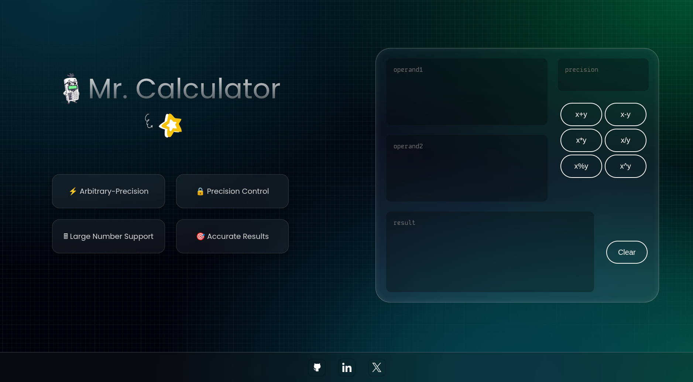

# Mr. Calculator 🧮

Mr. Calculator is a web application built with the **Fresh framework (Deno runtime)** that lets you perform calculations with **extremely large numbers**.  
It uses the **Big.js** library for arbitrary-precision arithmetic, ensuring accurate results even for massive values.  

---

## ✨ Features

- **Arbitrary-precision arithmetic:** Perform calculations beyond JavaScript’s number limitations using **Big.js**.  
- **User-friendly interface:** Clean and intuitive design for seamless interaction.  
- **Lightweight & fast:** Powered by the **Fresh framework** on Deno.  

---

## 🛠️ Tech Stack

- **Framework:** [Fresh](https://fresh.deno.dev/) (Deno runtime)  
- **Styling:** CSS  
- **Math Engine:** [Big.js](https://github.com/MikeMcl/big.js/)  

---

## 📸 Screenshot

 

---

## 🚀 Getting Started

### Prerequisites
- [Deno](https://deno.land/) installed  

### Run locally
```bash
deno task start
```

Then open: [http://localhost:8000](http://localhost:8000)  

---